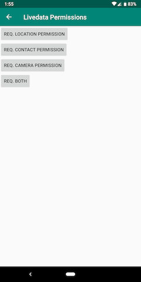

# Eazy Runtime Permission
[](https://github.com/sagar-viradiya/eazypermissions/blob/master/LICENSE) [](https://travis-ci.com/sagar-viradiya/eazypermissions) [](https://android-arsenal.com/api?level=20) [](https://ktlint.github.io/) []( https://android-arsenal.com/details/1/7799 )
> This is non-androidX version of library to support folks who are still on support of support lib :smile:. New features and bug fixes will be available for this version also but not for long so I would highly recommend folks to move to androidX ASAP. 

A lightweight Android library which wraps boilerplate code of runtime permission and allows you to request permissions from coroutines (No callbacks yay :tada:) or request and observe permissions through LiveData.

## Including in your project
Eazy permissions is available in the Jcenter and divided into two modules so that based on your need you can include either coroutines or livedata in your project

```groovy
//For coroutines
implementation 'com.sagar:coroutinespermission:[latest_version]'

//For LiveData
implementation 'com.sagar:livedatapermission:[latest_version]'
```
- `latest_version` for coroutines - [  ](https://bintray.com/sagar-viradiya/eazypermissions/coroutinespermission/_latestVersion)
- `latest_version` for livedata - [  ](https://bintray.com/sagar-viradiya/eazypermissions/livedatapermission/_latestVersion)

## Coroutines support
Requesting permission is just a simple function call to suspending function `requestPermissions` of [`PermissionManager`](coroutinespermission/src/main/java/com/eazypermissions/coroutinespermission/PermissionManager.kt) from your coroutines or other suspending function which will return [`PermissionResult`](common/src/main/java/com/eazypermissions/common/model/PermissionResult.kt). It takes 3 parameters.
1. An instance of AppCompactActivity or Fragment depending on from where you are requesting permission.
2. Request id.
3. varargs of permission you want to request.

This is how you would request for permission within coroutines and get result sequentially.

```kotlin
.
.
.
launch {
    //CoroutineScope

    val permissionResult = PermissionManager.requestPermissions(           //Suspends the coroutine
                            this@Fragment,                                  
                            REQUEST_ID,
                            Manifest.permission.ACCESS_FINE_LOCATION,
                            Manifest.permission.READ_CONTACTS,
                            Manifest.permission.CAMERA
                        )
                        
    //Resume coroutine once result is ready
    when(permissionResult) {
        is PermissionResult.PermissionGranted -> {
            //Add your logic here after user grants permission(s)
        }
        is PermissionResult.PermissionDenied -> {
            //Add your logic to handle permission denial
        }
        is PermissionResult.PermissionDeniedPermanently -> {
            //Add your logic here if user denied permission(s) permanently.
            //Ideally you should ask user to manually go to settings and enable permission(s)
        }
        is PermissionResult.ShowRational -> {
            //If user denied permission frequently then she/he is not clear about why you are asking this permission.
            //This is your chance to explain them why you need permission.
        }
    }

}
```
You can request permission from coroutine launched using any dispatcher(IO/Default/Main).

Library exposes [`PermissionResult`](common/src/main/java/com/eazypermissions/common/model/PermissionResult.kt) as result of permission request which is nothing but simple sealed class which wraps all possible outcomes.
```kotlin
sealed class PermissionResult {
    class PermissionGranted(val requestId: Int) : PermissionResult()
    class PermissionDenied(val requestId: Int, val deniedPermissions: List<String>) : PermissionResult()
    class ShowRational(val requestId: Int) : PermissionResult()
    class PermissionDeniedPermanently(val requestId: Int, val permanentlyDeniedPermissions: List<String>) : PermissionResult()
}
```
Notice `PermissionDenied` and `PermissionDeniedPermanently` are also exposing list of denied permissions and permanently denied permissions respectively so that you can decide your flow based on denied permissions if you want to.

## LiveData support
Just in case of coroutine we saw above requesting permission is just a simple method call to [`PermissionManager`](livedatapermission/src/main/java/com/eazypermissions/livedatapermission/PermissionManager.kt) from your Activity/Fragment. It takes 3 parameters.
1. An instance of AppCompactActivity or Fragment depending from where you are requesting permission.
2. Request id.
3. varargs of permission you want to request.

This is how you request permissions from your Activity/Fragment.
```kotlin
PermissionManager.requestPermissions(
                this,
                REQUEST_ID,
                Manifest.permission.ACCESS_FINE_LOCATION,
                Manifest.permission.READ_CONTACTS
            )
```

### Observing permission request result
With just one simple step(implementing an interface) you are ready to observe the result of request.
Your Activity/Fragment must implement `setupObserver` method of [`PermissionObserver`](https://github.com/sagar-viradiya/eazypermissions/blob/e1a36d5fb3ad487ac22da9b18e9b4c848cfcb74c/livedatapermission/src/main/java/com/eazypermissions/livedatapermission/PermissionManager.kt#L115) interface which expose LiveData<[`PermissionResult`](common/src/main/java/com/eazypermissions/common/model/PermissionResult.kt)>. Here is the definition of [`PermissionObserver`](https://github.com/sagar-viradiya/eazypermissions/blob/e1a36d5fb3ad487ac22da9b18e9b4c848cfcb74c/livedatapermission/src/main/java/com/eazypermissions/livedatapermission/PermissionManager.kt#L115)
```kotlin
/**
 * Interface definition for a callback to get [LiveData] of [PermissionResult]
 *
 * Implement this interface to get [LiveData] for observing permission request result.
 */
interface PermissionObserver {
    fun setupObserver(permissionResultLiveData: LiveData<PermissionResult>)
}
```
The library will only call `setupObserver` method when you are requesting permission for the first time. All the successive call to `requestPermissions` method will use the same observer.

Just as you would observe other LiveData you can observe LiveData<[`PermissionResult`](common/src/main/java/com/eazypermissions/common/model/PermissionResult.kt)> as follow
```kotlin
override fun setupObserver(permissionResultLiveData: LiveData<PermissionResult>) {
    permissionResultLiveData.observe(this, Observer<PermissionResult> {
        when (it) {
            is PermissionResult.PermissionGranted -> {
                if (it.requestId == REQUEST_ID) {
                    //Add your logic here after user grants permission(s)
                }
            }
            is PermissionResult.PermissionDenied -> {
                if (it.requestId == REQUEST_ID) {
                    //Add your logic to handle permission denial
                }
            }
            is PermissionResult.PermissionDeniedPermanently -> {
                if (it.requestId == REQUEST_ID) {
                    //Add your logic here if user denied permission(s) permanently.
                    //Ideally you should ask user to manually go to settings and enable permission(s)
                }
            }
            is PermissionResult.ShowRational -> {
                if (it.requestId == REQUEST_ID) {
                    //If user denied permission frequently then she/he is not clear about why you are asking this permission.
                    //This is your chance to explain them why you need permission.
                }
            }
        }
    })
}
```
> It is mandatory to implement [`PermissionObserver`](https://github.com/sagar-viradiya/eazypermissions/blob/e1a36d5fb3ad487ac22da9b18e9b4c848cfcb74c/livedatapermission/src/main/java/com/eazypermissions/livedatapermission/PermissionManager.kt#L115) from where you are requesting permission(either Activity or Fragment).
If you don't then library will throw `IllegalArgumentException` stating that you have to implement [`PermissionObserver`](https://github.com/sagar-viradiya/eazypermissions/blob/e1a36d5fb3ad487ac22da9b18e9b4c848cfcb74c/livedatapermission/src/main/java/com/eazypermissions/livedatapermission/PermissionManager.kt#L115)

Library will take care of Activity/Fragment recreation so even if user rotates screen or due to some other reason if your Activity/Fragment gets recreated it will call `setupObserver` method to register new observer of LiveData.

## Contributing
Have suggestions for improvements and want to contribute? or Found any issues?  
Head over to [Contribution guidelines](CONTRIBUTING.md) to know more about contributing to this library.

## Screenshots of sample
    
 

# License

```
Copyright 2019 Sagar Viradiya

Licensed under the Apache License, Version 2.0 (the "License");
you may not use this file except in compliance with the License.
You may obtain a copy of the License at

   http://www.apache.org/licenses/LICENSE-2.0

Unless required by applicable law or agreed to in writing, software
distributed under the License is distributed on an "AS IS" BASIS,
WITHOUT WARRANTIES OR CONDITIONS OF ANY KIND, either express or implied.
See the License for the specific language governing permissions and
limitations under the License.
```
